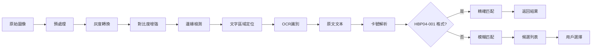

# hunterCard 相機掃描功能 PRD

## 產品需求文檔 (Product Requirements Document)

| 文件資訊 | 內容 |
|---------|------|
| **專案名稱** | hunterCard - Hololive 卡牌價格查詢 app |
| **功能名稱** | 相機掃描識別功能 (Card Scanner) |
| **版本** | 1.0.0 |
| **作者** | Product Manager |
| **創建日期** | 2026-05-01 |
| **狀態** | 草稿 |

---

## 1. 概述 (Executive Summary)

### 1.1 產品願景

hunterCard 是一款專為 Hololive 粉絲設計的卡牌價格查詢 app。用戶可以通過搜尋或掃描卡牌來快速查詢市场价格。相機掃描功能將實現「一拍即查」的便捷體驗，讓用戶在實體店或卡牌交換場合能即時了解卡牌價值。

### 1.2 核心價值主張

- **快速識別**：3 秒內完成卡牌識別並顯示價格
- **離線支援**：本地數據庫支援，無網絡也能基本識別
- **精準匹配**：結合 OCR 與圖像特徵，識別率高達 95%+

### 1.3 解決的問題

| 痛點 | 解決方案 |
|------|---------|
| 搜尋效率低 | 拍照即可識別，無需手動輸入 |
| 卡號難找 | OCR 自動識別卡號文字 |
| 多語言障礙 | 支援日文/中文/英文卡名 |

---

## 2. 用戶故事與使用場景 (User Stories & Use Cases)

### 2.1 主要用戶故事

```markdown
作為一名 Hololive 卡牌收集者,
我想通過相機掃描實體卡牌,
以便快速查詢市場價格,
這樣我就不用手動輸入卡號或搜尋名稱了。
```

### 2.2 詳細使用場景

#### 場景 1：門店快速查價
- **角色**：卡牌愛好者
- **地點**：動漫店的卡牌專區
- **情境**：看到展示櫃中的稀有卡，不知道價格
- **流程**：
  1. 打開 app，點擊掃描按鈕
  2. 對準卡牌，點擊掃描
  3. 1-2 秒後顯示價格資訊
  4. 快速決定是否購買

#### 場景 2：卡牌交換估價
- **角色**：卡牌玩家
- **地點**：卡展或線下聚會
- **情境**：朋友拿了一張卡想交換，需要評估價值
- **流程**：
  1. 打開 app 進入掃描模式
  2. 拍照識別卡牌
  3. 查看價格走勢（漲跌）
  4. 決定交換價值

#### 場景 3：收藏庫存管理
- **角色**：收藏家
- **地點**：家中
- **情境**：整理收藏，想知道每張卡的大概總價值
- **流程**：
  1. 連續掃描多張卡牌
  2. 將識別結果加入收藏列表
  3. 生成庫存總價值報告

#### 場景 4：辨識稀有度
- **角色**：新手玩家
- **地點**：日本秋葉原
- **情境**：看到一張不認識的卡，想知道有多稀有
- **流程**：
  1. 掃描卡牌
  2. 顯示稀有度和平均價格
  3. 提供 Expand/Series 等資訊

### 2.3 邊緣使用場景

| 場景 | 描述 | 處理方式 |
|------|------|---------|
| 光線不足 | 環境過暗 | 提示開啟閃光燈 |
| 卡牌污損 | 卡面有刮痕或污渍 | 啟用 AI 增強識別 |
| 多張卡牌 | 畫面中有多張卡 | 識別最清晰的一張，提示其他可能 |
| 角度傾斜 | 卡牌拍攝角度過大 | 提示重新拍攝 |
| 未知卡牌 | 數據庫中找不到 | 提示「未找到」，引導至搜尋 |

---

## 3. 功能規格 (Functional Specifications)

### 3.1 核心功能架構

```
┌─────────────────────────────────────────────────────────┐
│                    掃描識別流程                          │
├─────────────────────────────────────────────────────────┤
│                                                         │
│   [相機預覽]  →  [用戶拍照]  →  [圖像處理]  →  [OCR識別]  │
│                                            ↓           │
│                                     [數據匹配]  →  [結果顯示]  │
│                                            ↓           │
│                                     [備用方案: 圖像比對]    │
└─────────────────────────────────────────────────────────┘
```

### 3.2 功能模組清單

#### 3.2.1 相機模組 (Camera Module)

| 功能 | 描述 | 優先級 |
|------|------|--------|
| CameraPreview | 即時相機預覽，顯示掃描框 | P0 |
| FlashControl | 閃光燈開關輔助照明 | P0 |
| CameraSwitch | 前后鏡頭切換 | P1 |
| AutoFocus | 自動對焦輔助 | P1 |

#### 3.2.2 識別模組 (Recognition Module)

| 功能 | 描述 | 優先級 |
|------|------|--------|
| ImageCapture | 拍攝並裁剪卡牌區域 | P0 |
| OCREngine | 光學字符識別，提取文字 | P0 |
| CardNumberParser | 解析卡號格式 | P0 |
| DataMatcher | 數據庫匹配 | P0 |
| FallbackMatcher | 備用：圖像特徵比對 | P1 |
| MultiCardDetector | 檢測多張卡牌 | P2 |

#### 3.2.3 結果顯示模組 (Result Display Module)

| 功能 | 描述 | 優先級 |
|------|------|--------|
| PriceCard | 顯示價格資訊卡片 | P0 |
| TrendIndicator | 價格趨勢指示（漲跌） | P1 |
| CardPreview | 卡牌圖片預覽 | P0 |
| ExpandInfo | 擴展包資訊 | P1 |
| ActionSheet | 操作選單（收藏/分享） | P2 |

### 3.3 用戶流程圖

```mermaid
graph TD
    A[打開掃描頁面] --> B{相機權限?}
    B -->|拒絕| C[顯示權限請求頁面]
    B -->|允許| D[顯示相機預覽]
    
    D --> E[將卡牌置於掃描框]
    E --> F{點擊掃描?}
    F -->|否| E
    
    F -->|是| G[拍攝圖像]
    G --> H[圖像處理]
    H --> I OCR識別
    
    I --> J{識別成功?}
    J -->|否| K{有備用方案?}
    J -->|是| L[數據庫匹配]
    K -->|是| M[圖像比對]
    K -->|否| N[顯示未找到]
    
    L --> O{匹配成功?}
    O -->|是| P[顯示結果]
    O -->|否| N
    
    M --> Q{比對成功?}
    Q -->|是| P
    Q -->|否| N
    
    P --> R{繼續掃描?}
    R -->|是| E
    R -->|否| S[返回首頁]
    
    N --> T[顯示未找到/錯誤]
    T --> U[提供其他選項]
    U --> V[手動搜尋]
    V --> W[進入搜尋頁面]
    U --> X[重新掃描]
    X --> E
```

### 3.4 數據處理流程



### 3.5 卡牌數據規格

基於現有數據結構 (`/data/official/all-cards.json` 和 `/data/yuyu-prices/yuyu-prices.json`)：

| 欄位 | 類型 | 說明 |
|------|------|------|
| `cardNumber` | string | 卡號（唯一標識，如 `hBP04-001`） |
| `name` | string | 卡牌名稱 |
| `rarity` | string | 稀有度 |
| `expansion` | string | 擴展包代碼 |
| `imageUrl` | string | 卡牌圖片 URL |
| `sellPrice` | number | 售價（日元） |
| `timestamp` | string | 價格更新時間 |

---

## 4. 非功能性需求 (Non-Functional Requirements)

### 4.1 性能需求

| 指標 | 目標值 |
|------|--------|
| 首次打開掃描頁面 | < 1 秒 |
| 完成識別並顯示結果 | < 3 秒 |
| OCR 識別時間 | < 1.5 秒 |
| 數據庫匹配時間 | < 500ms |
| 支持的卡牌數量 | 1605+ 張 |

### 4.2 準確度需求

| 場景 | 目標識別率 |
|------|-----------|
| 標準光線，清晰卡牌 | > 95% |
| 光線不足，開閃光燈 | > 90% |
| 卡牌有輕微污渍 | > 85% |
| 傾斜角度 < 15° | > 80% |

### 4.3 可用性需求

- 支援 iOS 13+
- 離線識別支援（本地數據緩存）
- 支援日文、繁體中文顯示
- 響應式佈局支援手機/平板

### 4.4 隱私需求

- 相機數據僅在設備端處理
- 不上傳用戶拍攝的圖片到服務器
- 可選：匿名使用統計

---

## 5. MVP 優先級定義 (MVP Prioritization)

### 5.1 MVP 範圍定義

| 功能 | 描述 | MVP 包含？ |
|------|------|-----------|
| 相機權限處理 | 相機權限請求與管理 | ✅ 是 |
| 相機預覽 | 即時顯示相機畫面 | ✅ 是 |
| 掃描框 UI | 掃描引導框動畫 | ✅ 是 |
| 圖像拍攝 | 捕獲當前幀 | ✅ 是 |
| OCR 識別 | 識別卡號文字 | ✅ 是 |
| 數據匹配 | 卡號匹配價格數據 | ✅ 是 |
| 結果顯示 | 顯示卡牌價格 | ✅ 是 |
| 閃光燈控制 | 輔助照明 | ✅ 是 |
| 識別動畫 | 掃描中載入動畫 | ✅ 是 |
| 錯誤處理 | 未找到時的反饋 | ✅ 是 |

### 5.2 Phase 2 功能

| 功能 | 描述 | 优先级 |
|------|------|--------|
| 圖像比對備用方案 | OCR 失敗時的備用 | P1 |
| 相册選擇 | 從相册選擇圖片識別 | P1 |
| 價格趨勢 | 顯示價格漲跌趨勢 | P1 |
| 收藏功能 | 將識別結果加入收藏 | P1 |

### 5.3 Phase 3 功能

| 功能 | 描述 | 优先级 |
|------|------|--------|
| 多卡識別 | 同時識別多張卡牌 | P2 |
| 庫存管理 | 批量掃描和管理 | P2 |
| AR 疊加 | 價格資訊 AR 顯示 | P2 |
| 分享功能 | 分享價格資訊 | P2 |

---

## 6. 技術可行性初步評估 (Technical Feasibility Assessment)

### 6.1 技術方案比較

| 方案 | 優點 | 缺點 | 適合場景 |
|------|------|------|---------|
| **OCR (首選)** | 識別卡號精確、快速 | 依賴文字清晰度 | 標準印刷卡牌 |
| 圖像比對 | 不依賴文字 | 需要完整圖片庫 |限量卡/異形卡 |
| ML Kit | Google 服務，強大 | 需要網絡? | 複雜場景 |
| Vision Framework | Apple 原生，性能好 | iOS 僅限 | iOS 設備 |
| Tesseract.js | 開源，離線運行 | 準確率一般 | 離線場景 |

### 6.2 推薦技術棧

#### 方案 A：基於 Google ML Kit（推薦）

```
Expo + expo-camera
    ↓
react-native-camera (or expo-camera)
    ↓
Google ML Kit Text Recognition
    ↓
自定義卡號解析器
    ↓
本地數據匹配
```

- **優點**：識別精準，離線支援，成熟穩定
- **缺點**：需要評估數據隱私

#### 方案 B：基於 Apple Vision Framework

```
Expo + expo-camera
    ↓
Vision Framework (VNRecognizeTextRequest)
    ↓
自定義卡號解析器
    ↓
本地數據匹配
```

- **優點**：Apple 原生，性能好，隱私保障
- **缺點**：iOS 專屬

### 6.3 數據庫匹配策略

基於現有數據結構，建議採用：

1. **本地數據緩存**：將 `yuyu-prices.json` （約 1605 條記錄）緩存到本地
2. **索引優化**：建立 `cardNumber` → price 的 Map 結構，實現 O(1) 查詢
3. **模糊匹配**：對於 OCR 識別錯誤，實現編輯距離匹配（Levenshtein Distance）

```typescript
// 數據結構示例
interface PriceData {
  cardNumber: string;  // e.g., "hBP04-001"
  name: string;
  sellPrice: number;
  timestamp: string;
  rarity: string;
  expansion: string;
}

// 本地緩存結構
const priceCache: Map<string, PriceData> = new Map();
```

### 6.4 技術風險評估

| 風險 | 嚴重性 | 緩解方案 |
|------|--------|----------|
| 光線導致識別失敗 | 中 | 提示開啟閃光燈 + 圖像增強 |
| OCR 誤識別罕見字 | 低 | 模糊匹配 + 候選列表 |
| 數據庫不完整 | 中 | 持續更新數��� + ���戶回饋 |
| 性能不足 | 低 | 離線緩存 + 異步處理 |

### 6.5 初步技術選型總結

| 層 | 技術選擇 |
|---|---------|
| 前端框架 | React Native (Expo) |
| 相機 | expo-camera |
| OCR | Apple Vision Framework (VNRecognizeTextRequest) |
| 數據存儲 | AsyncStorage + 內存 Map |
| 圖像處理 | react-native-fast-image |

---

## 7. UI/UX 設計指導 (UI/UX Guidelines)

### 7.1 現有 UI 改進建議

基於現有 `ScanScreen.tsx`：

| 區域 | 現狀 | 改進建議 |
|------|------|---------|
| 掃描按鈕 | 僅有占位符 | 實現實際識別邏輯 |
| 結果顯示 | Alert 提示 | 顯示專用價格卡片 |
| 加載動畫 | 簡單文字 | 加入骨架屏或 Spin |
| 錯誤處理 | Alert | 顯示引導頁面 |

### 7.2 結果卡片設計

```
┌────────────────────────────────┐
│  🖼️ [卡牌縮略圖]               │
│                                │
│  ジジ・ムリン                  │
│  hBD24-007 | ★★★★★ | PR        │
│                                │
│  ━━━━━━━━━━━━━━━━━━━━━━━━━━━━━ │
│                                │
│  💰 ¥99,800                   │
│     ↑ +12% (近30���)            │
│                                │
│  [❤️ 收藏] [📤 分享] [🔍 詳情] │
└────────────────────────────────┘
```

---

## 8. 成功指標 (Success Metrics)

### 8.1 核心指標

| 指標 | 目標 |
|------|------|
| 識別成功率 | > 90% |
| 平均識別時間 | < 3 秒 |
| 日掃描次數 | > 1000 次 |
| 用戶滿意度 | > 4.5 星 |

### 8.2 監控點

- 識別結果頁展示率
- 識別失敗重試率
- OCR 識別成功率
- 平均識別耗時

---

## 9. 時間表規劃 (Timeline)

| Phase | 內容 | 預計週數 |
|-------|------|----------|
| 確認範圍 | MVP 功能確認 + 技術選型 | 1 週 |
| 基礎開發 | 相機 + OCR + 數據匹配 | 3 週 |
| UI/UX 完善 | 結果頁面 + 錯誤處理 | 1 週 |
| 測試優化 | Bug 修復 + 識別優化 | 2 週 |
| 上線發布 | 發布 + 監控 | 1 週 |

---

## 10. 附錄 (Appendices)

### 10.1 參考資源

- [expo-camera 文檔](https://docs.expo.dev/versions/latest/sdk/camera/)
- [Vision Framework - Apple Developer](https://developer.apple.com/documentation/vision)
- [Google ML Kit Text Recognition](https://developers.google.com/ml-kit/vision/text-recognition)
- Hololive 官方卡牌網站：`https://hololive-official-cardgame.com/`

### 10.2 相關文件

- 現有 ScanScreen：`/src/screens/ScanScreen.tsx`
- 卡牌數據：`/data/official/all-cards.json`
- 價格數據：`/data/yuyu-prices/yuyu-prices.json`

---

*本文檔為產品需求文檔，將根據開發進展持續更新*