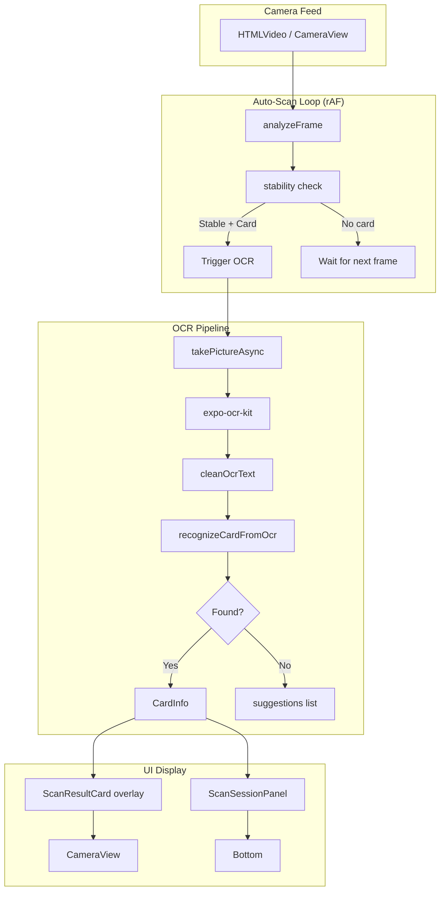

# 自動掃描報價功能 Implementation Plan

> **Goal:** 將目前的 manual scan（按鈕→拍照→OCR）改造成像 Rare Candy Scanner 3.0 那樣相機對到卡牌就自動掃描、立即顯示價格

**Current State:** 掃描畫面、OCR、卡牌比對、價格查詢、ScanSessionPanel 全部已建好
**Key Change:** 從手動觸發改為自動連續幀檢測 + 自動 OCR + 即時價格 overlay

---

### Task 1: 新增自動掃描偵測服務 (`autoScanService.ts`)

**Objective:** 建立卡牌在框內的自動檢測邏輯 — 用 Canvas 取 camera frame 分析亮度/邊緣來判斷卡牌是否穩定置中

**Files:**
- Create: `src/services/autoScanService.ts`
- No test file needed (visual detection, tested via component)

**Implementation:**

```typescript
// src/services/autoScanService.ts
// Auto-scan detection service — analyzes camera frames to detect
// when a card is centered and stable in the scan area

/**
 * Frame analysis result
 */
export interface FrameAnalysis {
  hasCard: boolean;        // Card detected in frame
  isStable: boolean;       // Card position stabilized
  confidence: number;      // 0-1 detection confidence
  brightness: number;      // Average brightness
  edgeDensity: number;     // Edge density (card has straight edges)
}

/**
 * Analyze a single video frame for card presence
 * Uses canvas to extract pixel data and detect card characteristics
 */
export function analyzeFrame(
  videoElement: HTMLVideoElement,
  scanArea: { x: number; y: number; width: number; height: number }
): FrameAnalysis {
  const canvas = document.createElement('canvas');
  canvas.width = scanArea.width;
  canvas.height = scanArea.height;
  const ctx = canvas.getContext('2d');
  if (!ctx) return { hasCard: false, isStable: false, confidence: 0, brightness: 0, edgeDensity: 0 };

  ctx.drawImage(videoElement, scanArea.x, scanArea.y, scanArea.width, scanArea.height, 0, 0, scanArea.width, scanArea.height);
  const imageData = ctx.getImageData(0, 0, scanArea.width, scanArea.height);
  const pixels = imageData.data;

  // Calculate average brightness
  let totalBrightness = 0;
  for (let i = 0; i < pixels.length; i += 4) {
    totalBrightness += (pixels[i] + pixels[i + 1] + pixels[i + 2]) / 3;
  }
  const brightness = totalBrightness / (pixels.length / 4) / 255;

  // Edge detection using Sobel-like horizontal gradient
  const width = scanArea.width;
  const height = scanArea.height;
  let edgePixels = 0;
  const threshold = 30; // Edge threshold

  for (let y = 1; y < height - 1; y++) {
    for (let x = 1; x < width - 1; x++) {
      const idx = (y * width + x) * 4;
      const left = ((y * width + (x - 1)) * 4);
      const right = ((y * width + (x + 1)) * 4);
      const top = (((y - 1) * width + x) * 4);
      const bottom = (((y + 1) * width + x) * 4);

      const gx = Math.abs(
        (pixels[left] + pixels[left + 1] + pixels[left + 2]) / 3 -
        (pixels[right] + pixels[right + 1] + pixels[right + 2]) / 3
      );
      const gy = Math.abs(
        (pixels[top] + pixels[top + 1] + pixels[top + 2]) / 3 -
        (pixels[bottom] + pixels[bottom + 1] + pixels[bottom + 2]) / 3
      );

      if (gx + gy > threshold) edgePixels++;
    }
  }

  const edgeDensity = edgePixels / (width * height);

  // Card detection heuristic:
  // Cards typically have: moderate brightness (not too dark/light), straight edges
  const hasCard = brightness > 0.15 && brightness < 0.85 && edgeDensity > 0.08 && edgeDensity < 0.5;
  const confidence = Math.min(1, Math.max(0,
    (hasCard ? 0.6 : 0) +
    (brightness > 0.2 && brightness < 0.8 ? 0.2 : 0) +
    (edgeDensity > 0.1 && edgeDensity < 0.4 ? 0.2 : 0)
  ));

  return { hasCard, isStable: false, confidence, brightness, edgeDensity };
}

/**
 * Frame buffer for stability detection
 */
const frameHistory: FrameAnalysis[] = [];
const STABILITY_FRAMES = 5; // Need 5 consecutive frames with card

/**
 * Analyze frame with stability tracking
 */
export function analyzeFrameWithStability(
  videoElement: HTMLVideoElement,
  scanArea: { x: number; y: number; width: number; height: number }
): FrameAnalysis {
  const result = analyzeFrame(videoElement, scanArea);

  frameHistory.push(result);
  if (frameHistory.length > STABILITY_FRAMES + 3) {
    frameHistory.shift();
  }

  // Check stability: last N frames all detected card
  const recentFrames = frameHistory.slice(-STABILITY_FRAMES);
  const allDetected = recentFrames.length >= STABILITY_FRAMES &&
    recentFrames.every(f => f.hasCard);

  // Check brightness variance (if it suddenly changes, card was moved)
  const brightnessVariance = recentFrames.length > 1
    ? Math.max(...recentFrames.map(f => f.brightness)) - Math.min(...recentFrames.map(f => f.brightness))
    : 1;
  const brightnessStable = brightnessVariance < 0.15;

  result.isStable = allDetected && brightnessStable;

  return result;
}

/**
 * Reset frame history (call after successful scan or camera switch)
 */
export function resetAutoScan(): void {
  frameHistory.length = 0;
}
```

---

### Task 2: 修改 ScanScreen — 加入自動掃描模式

**Objective:** 在現有 ScanScreen 中加入自動掃描邏輯。使用 requestAnimationFrame 循環分析 camera frames，當檢測到卡牌穩定在框內時自動觸發 OCR。

**Files:**
- Modify: `src/screens/ScanScreen.tsx`

**Key changes:**

1. Add state: `autoScanEnabled` (default: true), `isAutoScanning` (when analyzing frames)
2. Add a `useEffect` that when `isCameraReady && autoScanEnabled`, starts a rAF loop
3. In the rAF loop, call `analyzeFrameWithStability` on the video/camera element
4. When `result.isStable && result.confidence > 0.7`, trigger OCR automatically
5. Add a toggle button for auto/manual scan mode
6. After OCR success, show a floating price card overlay on the camera view
7. Debounce auto-scans (don't re-scan same card within 3 seconds)
8. Disable the old `handleScan` Alert (replace with simpler scan or toggle)

**Implementation details:**

```typescript
// In ScanScreen.tsx, add these imports at the top
import { analyzeFrameWithStability, resetAutoScan } from '../services/autoScanService';

// Add these states:
const [autoScanEnabled, setAutoScanEnabled] = useState(true);
const autoScanRef = useRef<number | null>(null);
const lastScanTimeRef = useRef<number>(0);
const SCAN_COOLDOWN_MS = 3000; // Don't re-scan same card within 3s

// Add auto-scan effect:
useEffect(() => {
  if (!isCameraReady || !autoScanEnabled) return;
  if (isScanning || isProcessingOCR) return;

  let mounted = true;
  const scanArea = {
    x: Math.round((SCREEN_WIDTH - SCAN_AREA_SIZE) / 2),
    y: Math.round(SCREEN_HEIGHT * 0.15),
    width: Math.round(SCAN_AREA_SIZE),
    height: Math.round(SCAN_AREA_SIZE * 0.63),
  };

  const loop = () => {
    if (!mounted) return;

    if (isWeb) {
      const video = document.querySelector('video');
      if (video && video.readyState >= 2) {
        const result = analyzeFrameWithStability(video, scanArea);
        if (result.isStable && result.confidence > 0.7) {
          const now = Date.now();
          if (now - lastScanTimeRef.current > SCAN_COOLDOWN_MS) {
            lastScanTimeRef.current = now;
            captureAndRecognize();
          }
        }
      }
    } else {
      // Native: use CameraView ref to get frame
      // For native, we need a different approach
      // For now, just skip auto-scan on native (manual mode still works)
    }

    autoScanRef.current = requestAnimationFrame(loop);
  };

  autoScanRef.current = requestAnimationFrame(loop);
  return () => {
    mounted = false;
    if (autoScanRef.current) {
      cancelAnimationFrame(autoScanRef.current);
    }
  };
}, [isCameraReady, autoScanEnabled, isScanning, isProcessingOCR]);
```

Also add:
- **Auto-scan toggle button** next to flash/flip controls
- **Price card overlay** that appears directly on camera when card is recognized (like Rare Candy)
- **Reset scanning** after successful recognition

And update `captureAndRecognize` to:
- Call `resetAutoScan()` after a successful scan
- Show inline price overlay instead of bottom panel toast

**Reduce duplicate code**: The web/native camera sections duplicate the same overlay/controls. Create a reusable overlay component to avoid the 2x duplication:

Actually, since there's already 1347 lines in ScanScreen, let's extract the camera overlay into a component.

---

### Task 3: 建立可重用的掃描覆蓋元件 (`ScanOverlay.tsx`)

**Objective:** 將 CameraView 和 WebCamera 共用的掃描框、按鈕、動畫提取成單一元件，消除 ScanScreen 中的大量重複程式碼

**Files:**
- Create: `src/components/ScanOverlay.tsx`

This component will contain:
- Scan area with animated scan line
- Corner decorations
- Flash/flip/scan controls
- Auto-scan mode toggle
- Price result card overlay

---

### Task 4: 優化圖庫選擇流程

**Objective:** 從相簿選圖後，如果能自動辨識出卡牌，直接在相機畫面顯示價格結果，不需跳 Alert

**Files:**
- Modify: `src/screens/ScanScreen.tsx`

Change `pickFromGallery` to:
1. After successful OCR, show the price inline on camera
2. Don't clear `capturedPhotoUri` — show it briefly

---

### Task 5: 跨平台相容

**Objective:** 確認自動掃描在 iOS/Android native 也能運作

**Challenge:** Web 版可以用 `<video>` element + Canvas frame analysis。Native 版需要不同的 frame capture 方式。

**Solution:**
- Web: Canvas from video element (already works)
- Native Expo: Use `CameraView` with `onBarCodeScanned` or... Actually expo-camera doesn't have frame processing.
- **Native fallback**: Keep manual scan for native (button press) — still works
- **Alternative for native**: Use expo-camera's `takePictureAsync` in a loop? No, too slow.
- **Best native approach**: Detect card via device motion + brightness sensor, not frame analysis

For now, **auto-scan for web only**, native keeps the manual scan. Document this limitation.

---

### Task 6: 建立掃描結果浮動價格卡元件 (`ScanResultCard.tsx`)

**Objective:** 在相機畫面上顯示一個半透明的價格結果卡，類似 Rare Candy 的風格

**Files:**
- Create: `src/components/ScanResultCard.tsx`

```typescript
// ScanResultCard.tsx — floating result overlay on camera
// Shows: card name, card ID, price, confidence indicator
// Auto-dismisses after 5 seconds or on tap
```

---

### Task 7: 整合與測試

**Objective:** TypeScript 編譯檢查 + Web 端功能測試

**Steps:**
1. Run `npx tsc --noEmit` 確認無類型錯誤
2. Run `npx expo export --platform web` 確認建置成功
3. Web 端手動測試：打開掃描頁面，確認自動掃描 loop 啟動
4. 放一張卡在鏡頭前，確認自動觸發 OCR + 顯示價格

---

## Architecture Diagram



---

## Order of Tasks

1. Task 1: Create `autoScanService.ts` (foundation)
2. Task 3: Create `ScanOverlay.tsx` (reduce duplication first)
3. Task 6: Create `ScanResultCard.tsx` (result display)
4. Task 2: Modify `ScanScreen.tsx` (integrate auto-scan + new components)
5. Task 4: Optimize gallery flow
6. Task 7: Compile check + test

All 6 Tasks → then verify.

---

## Key Design Decisions

1. **Auto-scan only for web** — Native camera doesn't support frame analysis easily. Both still have manual scan.
2. **rAF loop for frame analysis** — Browser-native, efficient, no extra deps
3. **Stability buffer** — 5 consecutive frames with card before triggering (avoids false triggers)
4. **3-second cooldown** — Prevents repeated scans of same card
5. **Canvas-based detection** — No ML dependency, works with simple edge detection
